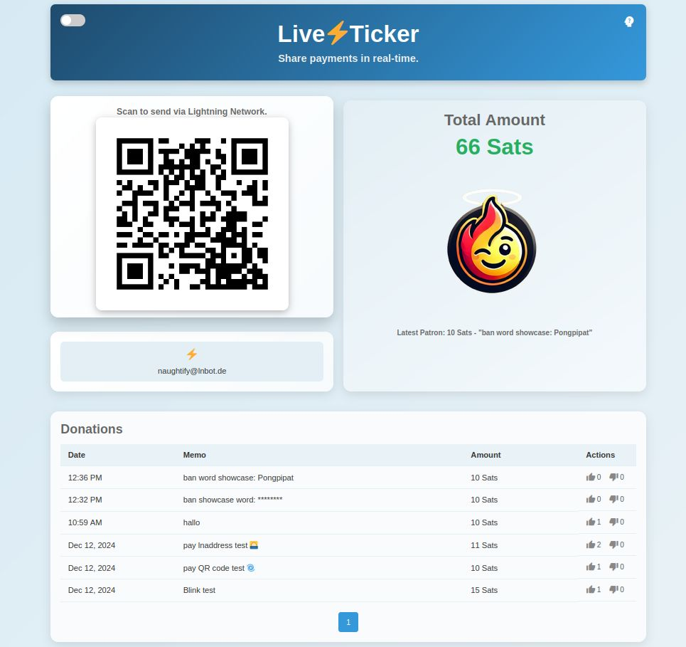
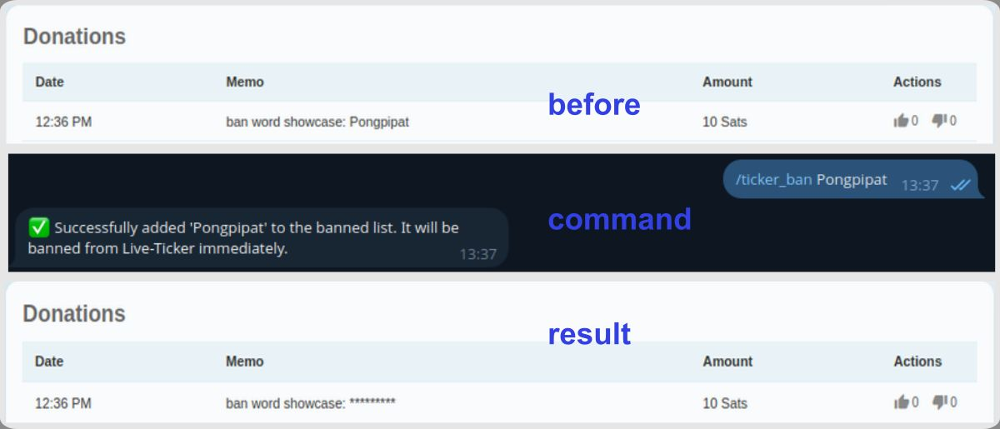
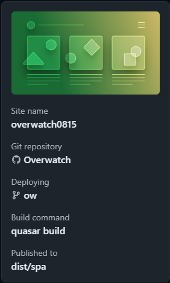
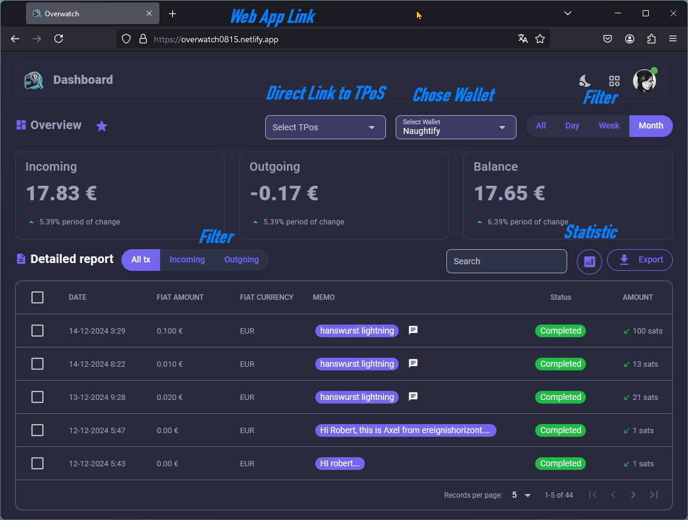

# 🤖 **Naughtify** 🤖<!-- omit from toc -->

LNbits Balance Monitor (aka. Naughtify) is your assistant for managing and monitoring your LNBits wallet. It connects to your LNbits instance and provides nearly real-time updates directly through Telegram. Additionally, the bot includes a dedicated view only transaction Overwatch as well as a LiveTicker Page specifically designed for static payment links.


 ### Table of contents <!-- omit from toc -->
- [🔍 **What Does This Bot Do?**](#-what-does-this-bot-do)
- [1. Prerequisites](#1-prerequisites)
- [2. Installation](#2-installation)
  - [2.1 Clone the Repository](#21-clone-the-repository)
  - [2.2 Installing Dependencies in a Virtual Environment](#22-installing-dependencies-in-a-virtual-environment)
  - [2.3 Configure the Environment](#23-configure-the-environment)
- [3. Setting Up Caddy Web Server](#3-setting-up-caddy-web-server)
  - [3.1 Install Caddy](#31-install-caddy)
  - [3.2 Configure the Caddyfile](#32-configure-the-caddyfile)
  - [3.3 Reload Caddy](#33-reload-caddy)
- [4. Telegram Bot Webhook Setup](#4-telegram-bot-webhook-setup)
- [5. Naughtify Start](#5-naughtify-start)
  - [5.1 Start Manually](#51-start-manually)
  - [5.2 Autostart Service](#52-autostart-service)
- [6. Optional Additions](#6-optional-additions)
  - [6.1 Live⚡Ticker](#61-liveticker)
    - [Installation](#installation)
    - [Personalize page](#personalize-page)
    - [Good etiquette care](#good-etiquette-care)
  - [6.2 Overwatch](#62-overwatch)
- [7. Appendix](#7-appendix)
  - [7.1 Update Naughtify](#71-update-naughtify)
- [Contributing](#contributing)
- [Acknowledgments](#acknowledgments)

---

## 🔍 **What Does This Bot Do?** 
The bot offers:
- Provide updates of your wallet balance.
- A categorized view of recent transactions.
- Notifications about significant wallet changes.
- Direct access to LNbits, Overwatch, and a LiveTicker 📺 Page.

## 🛠️ **Available Commands** <!-- omit from toc -->
 
### 📊 **/balance** <!-- omit from toc -->
- Displays your current wallet balance in sats.
- Perfect for quickly checking your available funds.
### ⚡️ **/transactions** <!-- omit from toc -->
- Lists your recent wallet transactions in three categories:
  - **Incoming:** Payments you’ve received.
  - **Outgoing:** Payments you’ve sent.
  - **Pending:** Transactions still being processed.
### ℹ️ **/info** <!-- omit from toc -->
- Provides detailed information about the bot’s configuration, including:
  - Update intervals for balances and transactions.
  - Thresholds for notifications.
  - General details about your LNbits instance.
### ❓ **/help** <!-- omit from toc -->
- Displays this guide to help you use the bot effectively.

## 🔗 **Useful Links** <!-- omit from toc -->

- **LiveTicker Page**: Shows the latest donations, total donation balance, and memos. This page is tied to a static payment code and provides a transparent overview of donation activity.
- **Overwatch Dashboard**: A read-only dashboard for monitoring wallet activity and status.
- **LNbits Manage Dashboard**: Direct access to manage wallets, transactions, and settings.

## 💡 **Helpful Tips** <!-- omit from toc -->
- All timestamps are in **UTC** for consistency.
- Adjust notification thresholds to receive only relevant updates.
- Use the LNbits interface to maximize the potential of your wallet.
- The **LiveTicker Page** is perfect for tracking donations in real-time and sharing a public view of donation activity.

---

## Screenshots <!-- omit from toc -->
|                                 Balance Notification                                 |                                 Transaction Summary                                  |
| :----------------------------------------------------------------------------------: | :----------------------------------------------------------------------------------: |
|  |  |

---

## 1. Prerequisites 

1. **VPS:** Virtual private server or other computer that is publicly accessible via a web domain.
2. **Second Web Domain or Subdomain:** Required to serve the app and enable inline commands.
3. **LNbits Wallet:** Access your LNbits API key (read-only).
4. **Telegram Bot:** Create a Telegram bot via [BotFather](https://t.me/BotFather) and obtain your bot token.
5. **Chat ID:** Use the [@userinfobot](https://t.me/userinfobot) on Telegram to find your User ID = chat ID.

If you need help with the requirements, have a look here: __[prerequisites_help.md](prerequisites_help.md)__

---
## 2. Installation
### 2.1 Clone the Repository 
```
git clone https://github.com/DoktorShift/naughtify.git
cd naughtify
```

---
### 2.2 Installing Dependencies in a Virtual Environment
The dependencies are installed in a virtual environment so that they are isolated from the system. Even “pip” is not installed on every system from the outset, so here are a few preparations.
```bash
sudo apt-get update
sudo apt install python3-venv
sudo apt install python3-pip
```
Now we set up a virtual environment, activate it and install the dependencies in it.
```bash
python3 -m venv venv
source venv/bin/activate
pip install wheel
pip install -r requirements.txt
```
__Note:__ You can deactivate the editing mode of the virtual environment. It remains valid for the application. To reactivate the editing mode for the virtual environment, e.g. to update a dependency, you must first select the folder to which the virtual environment applies and then activate the virtual environment. 
```bash
# deactivate venv editing
deactivate
# activate venv editing
cd ~/naughtify
source venv/bin/activate
```

---
### 2.3 Configure the Environment
Settings are applied and parameters are transferred here.
1. Copy the `.env` and open it.
```bash
wget https://raw.githubusercontent.com/DoktorShift/naughtify/refs/heads/main/example.env
mv example.env .env
sudo nano .env
```
2. Fill in at least the first four fields of the template:
- Telegram Bot Token
- Chat ID (User ID)
- LNBIts Readonly key
- LNBits Server URL
These are heavily needed

---
## 3. Setting Up Caddy Web Server 
To expose the Flask app and enable inline commands, the Telegram bot must be able to reach the server. To do this, we use a subdomain, such as naughtify.yourdomain.com. Caddy then only needs to be set up as a reverse proxy on the server.
__Important:__ Make sure that you point the DNS addresses (A and AAAA, if applicable) of your subdomain/domain to the IP address of your Virtual Private Server so that the requests are forwarded to the VPS via the domain. If you do not yet have a domain, you can obtain a free subdomain from duckdns.org.  
### 3.1 Install Caddy
```bash
sudo apt install -y debian-keyring debian-archive-keyring apt-transport-https
curl -1sLf 'https://dl.cloudsmith.io/public/caddy/stable/gpg.key' | sudo gpg --dearmor -o /usr/share/keyrings/caddy-stable-archive-keyring.gpg
curl -1sLf 'https://dl.cloudsmith.io/public/caddy/stable/debian.deb.txt' | sudo tee /etc/apt/sources.list.d/caddy-stable.list
sudo apt update
sudo apt install caddy
```

-> Test the web server in your internet browser with: http://yourIPaddress. You should see a Caddy web page.

### 3.2 Configure the Caddyfile

Create and open your Caddyfile

```bash
 sudo nano /etc/caddy/Caddyfile
 ```

Fill the file with the following content and update `yourdomain.com` in one place:

```plaintext
# Configuration for Naughtify
naughtify.yourdomain.com {
    # Reverse proxy for webhook endpoints
    reverse_proxy /webhook* 127.0.0.1:5009
    # Reverse proxy for all other routes
    reverse_proxy * 127.0.0.1:5009
    # Enable GZIP compression
    encode gzip
    # Security headers
    header {
        Strict-Transport-Security "max-age=31536000; includeSubDomains; preload"
        X-Content-Type-Options "nosniff"
        X-Frame-Options "DENY"
        Referrer-Policy "no-referrer-when-downgrade"
        Content-Security-Policy
        "
          default-src 'self';
          script-src 'self';
          style-src 'self' 'unsafe-inline';
          img-src 'self' data:;
          connect-src 'self';
          font-src 'self';
          object-src 'none';
          frame-ancestors 'none';
          base-uri 'self';
          form-action 'self';
        "
    }
}
```

### 3.3 Reload Caddy

Restart or reload Caddy to apply the changes:
```bash
sudo systemctl reload caddy
```

If you now call up the web domain in the browser, you should see a `HTTP ERROR 502` error. This means that it reaches the Caddy server, but the forwarding to Naughtify fails. Which is no wonder, as Naughtify has not yet started. Later you will a white page with `🔍 LNbits Monitor is running.`.

If you still have a problem, the following commands may help with debugging:

```bash
sudo systemctl status caddy
sudo journalctl -u caddy -f --since "2 hour ago"
```
You can check whether the forwarding works, for example, with this: https://dnschecker.org/ <br>
The SSL certificate e.g. with this: https://www.sslshopper.com/ssl-checker.html

---

## 4. Telegram Bot Webhook Setup
To enable inline commands (like `/balance`, `/transactions`, `/info`, `/help`), connect your Telegram bot to the app:
1. **Prepare Your Webhook URL:**  
   Combine your domain with the `/webhook` endpoint.  
   Example:  
   ```
   https://naughtify.example.com/webhook
   ```
2. **Set the Webhook:**  
   Replace placeholders below with your **Telegram Bot Token** and **Webhook URL**:
   - **Using a Web Browser:**  
     ```
     https://api.telegram.org/bot<YOUR_BOT_TOKEN>/setWebhook?url=<YOUR_WEBHOOK_URL>
     ```
     Example:  
     ```
     https://api.telegram.org/bot123456:ABCDEF/setWebhook?url=https://naughtify.example.com/webhook
     ```
   - **Using cURL (Command Line):**  
     ```bash
     curl "https://api.telegram.org/bot<YOUR_BOT_TOKEN>/setWebhook?url=<YOUR_WEBHOOK_URL>"
     ```
3. **Verify the Webhook:**  
   Telegram should confirm:  
   ```json
   {
     "ok": true,
     "result": true,
     "description": "Webhook was set"
   }
   ```
---
## 5. Naughtify Start
### 5.1 Start Manually
```bash
python naughtify.py
```
Output:
```plaintext
[2024-11-28 15:14:32,759] [INFO] 🚀 Starting LNbits Balance Monitor.
[2024-11-28 15:14:32,760] [INFO] 🔔 Notification Threshold: 1 sats
[2024-11-28 15:14:32,760] [INFO] 📊 Fetching Latest 10 Transactions for Notifications
[2024-11-28 15:14:32,760] [INFO] ⏲️ Scheduler Intervals - Balance Change Monitoring: 60 seconds, Daily Wallet Balance Notification: 60 seconds, Latest Payments Fetch: 60 seconds
[2024-11-28 15:14:32,772] [INFO] Flask server running on 127.0.0.1:5009
 * Serving Flask app 'naughtify'
 * Debug mode: off
 * Running on http://127.0.0.1:5009
```
---
### 5.2 Autostart Service
1. Create new system service:
```bash
sudo nano /etc/systemd/system/naughtify.service
```

2. Fill in the file with the following information and customize `youruser` in __five__ places:

```plaintext
[Unit]
Description=Naughtify
After=network.target
[Service]
User=youruser
WorkingDirectory=/home/youruser/naughtify
EnvironmentFile=/home/youruser/naughtify/.env
ExecStart=/home/youruser/naughtify/venv/bin/python /home/youruser/naughtify/naughtify.py
Restart=on-failure
[Install]
WantedBy=multi-user.target
```
3. Activate, start and monitor:
```bash
sudo systemctl enable naughtify
sudo systemctl start naughtify
sudo systemctl status naughtify
```

From now on, naughtify will start automatically with every restart. 🎉

However, if you have problems, you can call up the logs with the following command:

```bash
sudo journalctl -u naughtify -f --since "2 hour ago"
```

---

## 6. Optional Additions

### 6.1 Live⚡Ticker

Naughtify can also provide a simple public website that displays the data and transactions of a wallet. This function is called “LiveTicker”. Examples of this would be a donation page or a crowdfunding page. Anyone can view the page, send funds directly, leave a comment (if desired) and shortly afterwards see that their contribution with the comment has been received, which can be particularly necessary for crowdfunding projects and ensures absolute transparency.

 

#### Installation

To use the LiveTicker, you need another subdomain via which the website can later be accessed. At the hosting provider, the A (and AAAA) entry for e.g. “liveticker.yourdomomain.com” must point to the server on which Naughtify is installed. The .env file must then be adapted accordingly and the entry added to Caddy.

__Call the .env to edit the data:__

```bash
sudo nano ~/naughtify/.env
```

Adjust the following values in the `LiveTicker Configuration` area:

```plaintext
DONATIONS_URL=YourLiveTickerPageURL <- liveticker.yourdomomain.com
LNURLP_ID=YourLNURPID <- The ID (6 letters) of the Pay Link instance
```

__Note:__ For more help on the LNURLP_ID, see point 3.3 of [prerequisites_help.md](./prerequisites_help.md).

__Extend the caddy file:__

```bash
sudo nano /etc/caddy/Caddyfile
```

Add the following content to the end of the file and customize `yourdomain.com` in one place: 

```plaintext
# Configuration for LiveTicker
liveticker.yourdomain.com {
    # Match for the root request
    @root path /
    # Rewrite root request to /donations
    rewrite @root /donations
    # Reverse proxy for all requests
    reverse_proxy 127.0.0.1:5009
    # Enable GZIP compression
    encode gzip
    # Set security headers
    header {
        Strict-Transport-Security "max-age=31536000; includeSubDomains; preload"
        X-Content-Type-Options "nosniff"
        X-Frame-Options "DENY"
        Referrer-Policy "no-referrer-when-downgrade"
        Content-Security-Policy
        "
            default-src 'self';
            script-src 'self' 'unsafe-inline';
            style-src 'self' 'unsafe-inline' https://fonts.googleapis.com;
            font-src 'self' https://fonts.gstatic.com;
            img-src 'self' data:;
            connect-src 'self';
            object-src 'none';
            frame-ancestors 'none';
            base-uri 'self';
            form-action 'self';
        "
    }
}
```

Reload Caddy to apply the changes:

```bash
sudo systemctl reload caddy
```

If you now call up your domain `liveticker.yourdomain.com`, you should see your LiveTicker website. 📺

#### Personalize page

The structure of the Live⚡Ticker page is fixed. However, you can customize the content. The template for this is a simple html file that can be called up with the following command: `nano ~/naughtify/templates/donations.html`. You can find the template [here](https://github.com/DoktorShift/naughtify/blob/main/templates/donations.html). With a little searching and comparing you will find the appropriate places where you can adjust the files from the text or the link path. Once the changes have been made, simply restart the server once `sudo systemctl start naughtify` and call up the website again.

#### Good etiquette care

Some comments may not be appropriate or someone may have inadvertently revealed something that they regret afterwards. There needs to be a way to clean this up. Therefore the list `forbidden_words.txt` and the command `/ticker_ban` was introduced. The list contains all words that you do not want to see on the screen. With the command `/ticker_ban` you can add words to this list from the Telegram bot. The words are then marked with asterisks.

 

### 6.2 Overwatch

Overwatch is a web app dashboard to conveniently display advanced wallet information and it also has a few additional features. It was primarily developed to keep track of and control wallets that are connected to Point of Sale terminals (TPoS). The boss app you could say. Several employees have a TPoS and the boss monitors the finances with Overwatch. Overwatch is an extension for Naughtify, but it also works as a stand-alone software application.

Overwatch currently requires an account at [netlify.com](https://www.netlify.com/) to deploy the web app. And an Overwatch repository (online or as a zip file) that has been customized for the LNbits server used is required.

Here is a guide on how to set up Overwatch:

<style>
  table td {
    border: none !important;
  }
</style>
<table>
 <tr>
    <td>
1. fork the GitHub repository and create a new branch called “ow”.<br>
2. in the files `/src/layouts/MainLayout.vue`, `/src/pages/IndexPage.vue` and `/src/pages/LoginBasic.vue` search for the word combination `timecatcher.lnbits.de` and replace it with the new LNbits server domain, such as lnbits.yourdomain.com.<br>
3. save the changes and make sure the branch is publicly available, or export the branch as a zip file.<br>
4. set up an account at netlify.com and when asked which project you want to deploy, import it from GitHub and link to your GitHub account, or import the prepared zip file. <br>
5. give the page a unique name. For example similar to `overwatch0815` and check the availability.<br>
6. set the `Branch to deploy` to your `ow` if you have more than one.<br>
7. fill the field `Build command` with `quasar build` and the field `Publish Directory` with `dist/spa`.<br>
8. select `Deploy overwatch0815` to deploy the page. <br>
9. after the site has been successfully deployed, go to `View site deploy`.<br>
10. select `Open production deploy` to open your Overwatch site.</td>
    <td> </td>
 </tr>
</table>

What you are still missing is the username and password. Since Overwatch displays the data of an LNbits wallet, you must now enter the username and password of your LNbits account here. If your LNbits account does not yet have a username and password, you can assign them under 'My Account' (icon in the top right corner) and use them to log in.

 


Optionally, you can integrate the link to Overwatch into Naughtify. To do this, you must edit the .env and then restart Naughtify once.

Open .env to edit

```bash
sudo nano ~/naughtify/.env
```

Search for `# OVERWATCH_URL=YourOverwatchURL`. Remove `#` and customize it for yourself:

```plaintext
OVERWATCH_URL=https://lnbits.yourdomain.com
```

Restart Server:

```bash
sudo systemctl restart naughtify
```

From now on, the Overwatch link should also be stored in the Naughtify Telegram bot. Since the call is now made on your smartphone with your own browser, you will probably also have to log in with your username and password.

You can find more information in the original [Overwatch repository](https://github.com/DoktorShift/Overwatch).

---

## 7. Appendix

### 7.1 Update Naughtify

New version available? Here is the way to update Naughtify to the latest version.

Simple `git pull` to pull latest version:

```bash
# git pull
cd ~/naughtify
git pull
```

Does the .env also need to be updated?

```bash
# backup .env
cd ~/naughtify
cp .env .env.bak
# edit .env
sudo nano .env
# compare with:
# https://github.com/DoktorShift/naughtify/blob/main/example.env
```

Have requirements changed?

```bash
# compare stock
cat requirements.txt
# with:
# https://github.com/DoktorShift/naughtify/blob/main/requirements.txt
```

Update requirements:

```bash
cd ~/naughtify
source venv/bin/activate
pip install -r requirements.txt
deactivate
```

Finally, restart the server and check journal:

```bash
sudo systemctl restart naughtify
sudo journalctl -u naughtify -f --since "2 hour ago"
```
---

## Contributing
I welcome feedback and pull requests! Feel free to submit issues or enhance the app with new features.  
Licensed under the MIT License.
### A Note on This Solution <!-- omit from toc -->
This bot is a simple hack designed to keep you informed about your LNbits wallet activity. While it fulfills its purpose, a more robust solution could be built as an official LNbits extension.  
If you're inspired to take this further, feel free to develop a proper LNbits extension! You can find detailed information on creating an extension here:  
[**LNbits Extensions Wiki**](https://github.com/lnbits/lnbits/wiki/LNbits-Extensions)

Additionally, you're welcome to explore the [Live-Ticker](https://donations.lnbot.de) feature. Testing it while donating helps support the project's development!

---
## Acknowledgments
A big thank you to [**AxelHamburch**](https://github.com/AxelHamburch) for expressing the need for this bot and inspiring its creation.  
A heartfelt thank you to the entire [**LNbits Team**](https://github.com/lnbits) for your incredible work on the outstanding [**LNbits**](https://lnbits.com) project. Your contributions make solutions like this possible!
