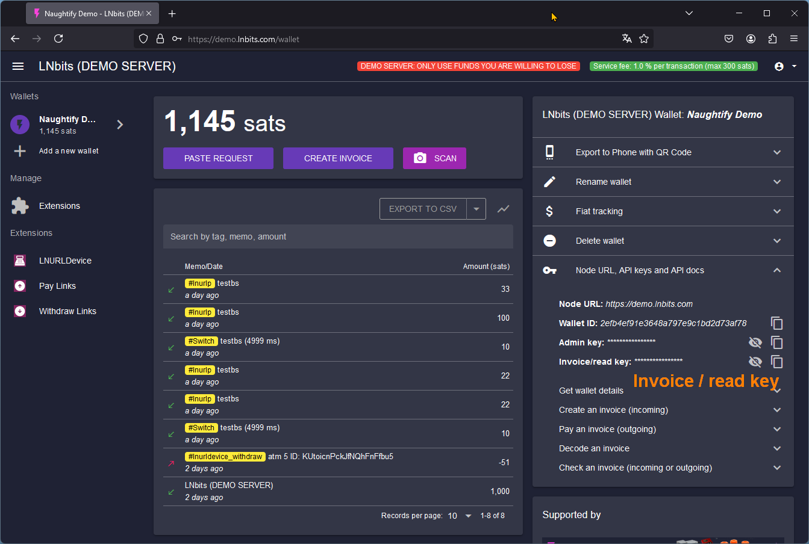
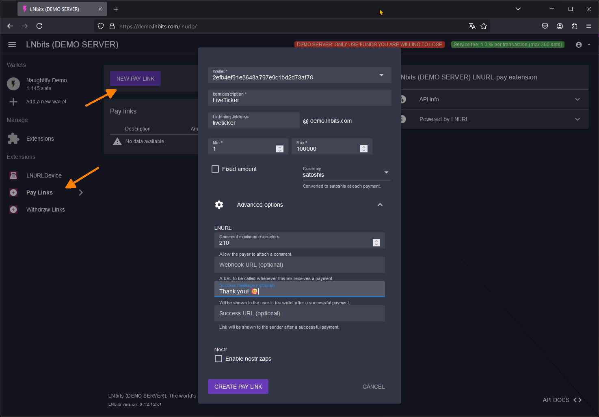
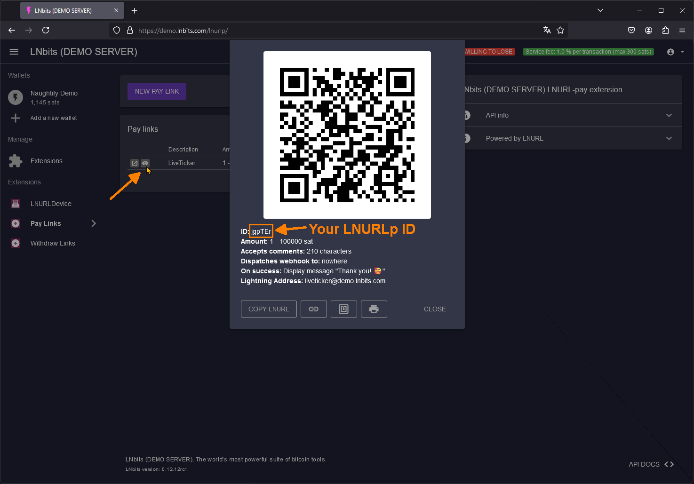
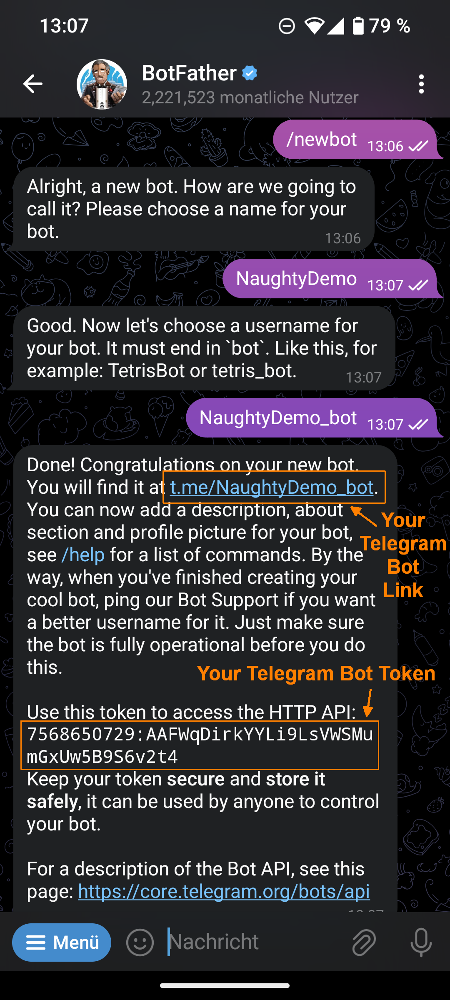
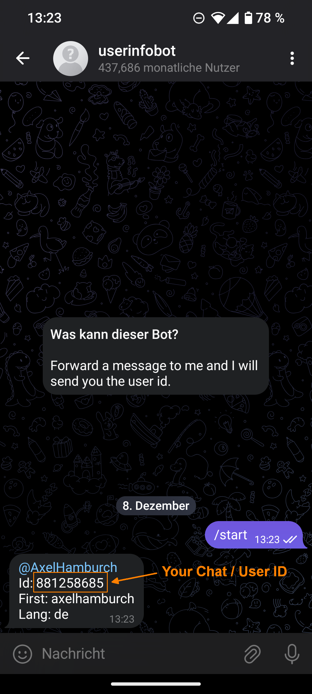

# 🤖 **Help with the prerequisites** 🤖

Naughtify requires some prerequisites that not everyone is familiar with. Here are some approaches that may help you.

1. VPS - Virtual Private Server
2. Domain - Your Link to the Server 
3. LNbits - The Wallet invoice key and LNURLp-ID
4. Telegram Bot - Botfather and bot token
5. UserInfoBot - Your User / Chat ID

### 1. VPS - Virtual Private Server

If you don't have your own LNbits server that is publicly accessible, then you can rent a small VPS. The smallest version with 1 CPU and 512 MB RAM should be enough. You can find out how to set up a VPS here, for example, under [7.1 - General - Setting up a Virtual Private Server (VPS)](https://ereignishorizont.xyz/lnbits-server/en/#71_-_General_-_Setting_up_a_Virtual_Private_Server_VPS). 

### 2. Domain - Your Link to the Server 

If you host your own LNbits server publicly, you also have your own domain. You can set up additional subdomains with domain hosting providers. If you don't have your own domain and use someone else's LNbits server, you can use [duckdns.org](https://www.duckdns.org/). There you can get a free subdomain in the format `mysubdomain.duckdns.org`. All you have to do is point the domain to the IP address of the VPS on which Naughtify is installed and set up Caddy accordingly. That's it. 

### 3. LNbits - The Wallet invoice key and LNURLp-ID

LNbits is a wallet and account system. Each account can have multiple wallets and add extensions for different functions. Below is a brief explanation of how to create a wallet, receive the wallet invoice key and generate a static LNURLpay link with a Lightning⚡ address.

3.1 Create an account with an LNbits server of your choice

E.g. at the official demo server [demo.lnbits.com](https://demo.lnbits.com) or at community driven TimeCatcher Server [timecatcher.lnbits.de](https://timecatcher.lnbits.de/). 

You will also receive an LNbits wallet with your account. If you have not logged in with your username and password, save the user ID of the account to be on the safe side. To do this, click on the “Person” icon at the top right, select “My Account” and make the user ID visible by clicking on the eye. Copy the user ID and put it away. This is your fall-back solution. You can use it to access your account again at any time.

3.2. Optain the Wallet Invoice Key 

In LNbits, click once on your wallet on the left and then you will see a key symbol 🗝️ on the right with the note `Node URL, API keys and API docs`. Select this and then copy the `Invoice/read key`. Save it well, you need it for the `.env` file.  

3.3. Optain the LNURLp-ID

For a static address and a Lightning⚡ address, the LNbits extension `Pay Links` is required. This can be added under `Manage > Extensions`. Once it has been added, you can add a new Pay Link instance under `Extensions > Pay Links > NEW PAY LINK`. You can find an example of this in the images below. Save the LNURLp ID as well, as you will need it for the `.env` file.

invoice read key          |  set up instance   |  LNURLp ID
:-------------------------:|:-------------------------:|:-------------------------:
  |    |   

### 4. Telegram Bot - Botfather and bot token

To create a bot, open the [@BotFather](https://t.me/BotFather) and click on `Start`. Write the command `/newbot` and then choose a name. Then give the bot a Telegram bot username by simply adding `_bot` after your bot name. The magic is done. The BotFather will then show you the link to your bot and token. Save both well.

### 5. UserInfoBot - Your User / Chat ID

To determine your own user ID (chat ID), open the [@userinfobot](https://t.me/userinfobot) and click on `Start`. That was it. The bot will now show you your user ID.

@BotFather            |  @userinfobot
:-------------------------:|:-------------------------:
  |   

---
### [Back to Naughtify Mainpage](./README.md)

